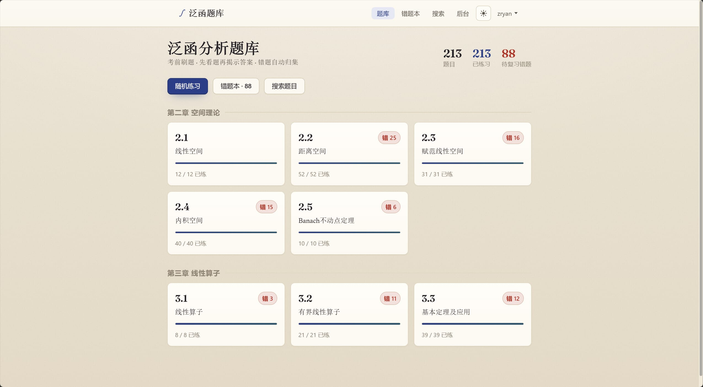
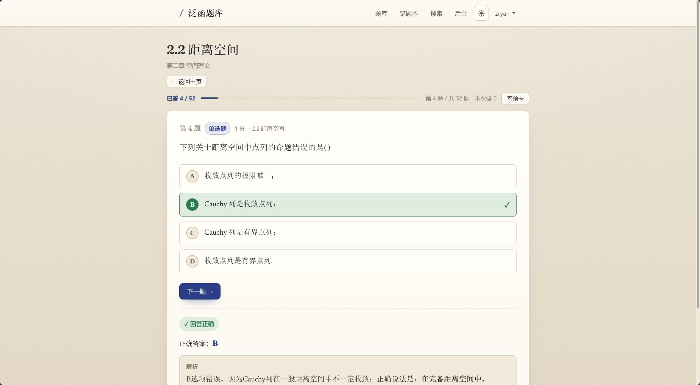
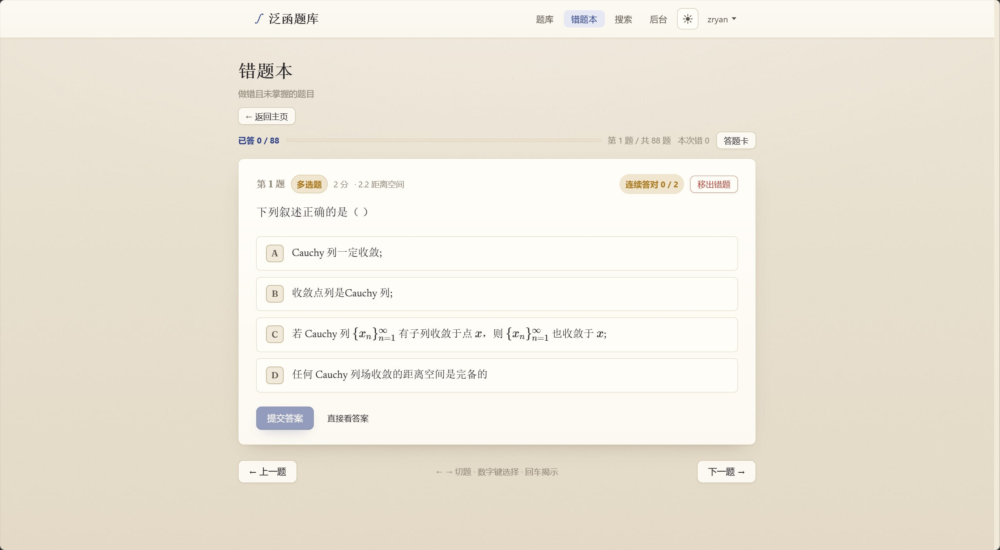

<div align="center">
  
  <h1>泛函题库</h1>
  <p><strong>FuncQBank</strong> · BUAA北航研究生泛函分析课程的 Web 题库</p>
  <p>
    <a href="https://fanhan.zryan.xyz/">在线访问</a>
    ·
    <a href="#项目介绍">项目介绍</a>
    ·
    <a href="#快速部署复用已解析出的题目内容">快速部署</a>
    ·
    <a href="#全流程部署">全流程部署</a>
  </p>
  <p>
    
    
    
    
  </p>
</div>

<p align="center">
  
  
  
</p>

## 项目介绍

泛函题库是一个用于BUAA北航研究生泛函分析课程复习的网页题库。项目将原本「题干、选项、答案混在同一张截图里」的题目图片，通过 LLM 结构化提取为「题干 / 选项 / 答案 / 解析」，再以题目答案分离的方式提供刷题、搜索、错题记录和后台校对能力。

已部署站点：https://fanhan.zryan.cn/

主要特性：

- **题答分离**：普通刷题页面只展示结构化题目内容，含答案的原始截图只允许管理员访问。
- **移动端友好**：服务端渲染、原生 JavaScript、手写 CSS，适合手机和桌面端直接刷题。
- **公式渲染**：数学公式使用 LaTeX 文本保存，前端通过本地内置 KaTeX 渲染，无需 CDN。
- **练习功能**：支持按章节刷题、随机练习、模拟考试、搜索筛选、错题本、掌握标记和答题进度记录。
- **后台校对**：管理员可对照原图修正题干、选项、答案、解析，并将题目标记为已校对。
- **自包含部署**：FastAPI + SQLite，前端无 Node 构建链；支持 `uv` 本机运行和 Docker 部署。

当前题库共收录 **213** 道题，分布在第二章「空间理论」（145 题）和第三章「线性算子」（68 题），题型涵盖单选、多选和判断。

技术栈：

| 层级 | 技术 |
| --- | --- |
| 后端 | FastAPI、SQLModel、SQLite |
| 前端 | Jinja2 模板、原生 JavaScript、KaTeX |
| 认证与安全 | 签名 Cookie、argon2 密码哈希、CSRF、基础限流、安全响应头 |
| 包管理 | uv |
| 部署 | Docker Compose 或裸机 uvicorn |

数据流：

```text
docs/ 原始题图
  -> scripts/extract.py 视觉模型识别
  -> data/extracted/*.json 结构化题目事实源
  -> scripts/generate_explanations.py 补充简短解析
  -> scripts/seed.py 导入 SQLite
  -> FastAPI Web 题库
```

## 直接使用

如果只是刷题，直接访问已部署站点即可：

https://fanhan.zryan.xyz/

常用入口：

- 首页按章节进入练习。
- 练习页可先作答，再提交查看答案；答错题目会进入错题本。
- 搜索页支持按题干关键词和题型筛选。
- 登录后可保存个人进度、错题记录和掌握标记。

快捷键：

| 快捷键 | 功能 |
| --- | --- |
| `←` / `→` | 切换上一题 / 下一题 |
| 数字键 | 选择选项 |
| `Enter` | 提交答案或进入下一题 |
| `m` | 标记 / 取消标记为掌握 |

说明：普通用户无法进入后台，也看不到原始题图——原图主要用于校对识别的题目，只对管理员开放。

## 快速部署（复用已解析出的题目内容）

本仓库已经包含结构化后的题目数据 `data/extracted/`。如果只是想部署同款题库，不需要重新调用大模型识别图片，直接复用这些 JSON 入库即可。

### 方式一：Docker Compose

```bash
git clone https://github.com/ZzzzRyan/FuncQBank.git
cd FuncQBank
cp .env.example .env
```

编辑 `.env`，至少修改：

```ini
SESSION_SECRET="改成一长串随机字符串"
REGISTRATION_OPEN=true
COOKIE_SECURE=false
TRUST_PROXY_HEADERS=true
```

如果只是复用已解析题目，`OPENAI_ENDPOINT`、`OPENAI_MODEL`、`OPENAI_APIKEY` 可以先留空或保留示例值；它们只在批量提取、生成解析、后台重新识别图片时需要。

启动服务：

```bash
docker compose up -d --build
```

默认访问地址：

```text
http://127.0.0.1:8000
```

Docker 部署说明：

- 容器首次启动会自动执行 `scripts/seed.py`，把 `data/extracted/` 导入数据库。
- SQLite 数据库存放在 Docker 卷 `funcqbank-data`（容器内路径 `/app/var/app.db`），因此重启或重建镜像都不会丢失用户、进度和人工校对数据。
- 第一个注册的账号会自动成为管理员，你也可以手动创建。

手动创建管理员：

```bash
docker compose exec app uv run --no-sync scripts/create_admin.py <用户名> --name "显示名"
```

### 方式二：本机 uv 运行

本项目约定所有 Python 依赖和脚本都使用 `uv` 管理。

```bash
git clone https://github.com/ZzzzRyan/FuncQBank.git
cd FuncQBank
uv sync
cp .env.example .env
```

编辑 `.env` 后导入题库并运行：

```bash
uv run scripts/seed.py
uv run scripts/create_admin.py <用户名> --name "显示名"
uv run uvicorn app.main:app --host 127.0.0.1 --port 8000
```

开发时可使用自动重载：

```bash
uv run uvicorn app.main:app --reload --port 8000
```

## 全流程部署

全流程适用于你希望从 `docs/` 中的原始题图重新识别题目、补充解析，再部署自己的题库实例的场景。

### 1. 准备环境

```bash
uv sync
cp .env.example .env
```

配置 `.env`：

```ini
# OpenAI 兼容、支持视觉输入的接口
OPENAI_ENDPOINT="https://你的网关/v1"
OPENAI_MODEL="你的视觉模型"
OPENAI_APIKEY="sk-..."

# Web 应用
SESSION_SECRET="改成一长串随机字符串"
REGISTRATION_OPEN=true
COOKIE_SECURE=false
TRUST_PROXY_HEADERS=true
```

生产环境建议用下面命令生成 `SESSION_SECRET`：

```bash
uv run python -c "import secrets; print(secrets.token_hex(32))"
```

### 2. 识别题目图片

先小批量试跑，确认模型输出质量和网关稳定性：

```bash
uv run scripts/extract.py --limit 5
```

全量识别：

```bash
uv run scripts/extract.py
```

脚本会自动跳过已成功提取的图片，可以随时中断再续跑。识别失败或被标记为需复核的题目，可以用下面命令重试：

```bash
uv run scripts/extract.py --retry-flagged
```

常用筛选参数：

```bash
uv run scripts/extract.py --only "3.2"  # 仅处理文件夹名称包含 "3.2" 的题目
uv run scripts/extract.py --workers 4   # 4 线程并行处理
uv run scripts/extract.py --force       # 强制覆盖已成功提取的题目（谨慎使用）
```

### 3. 生成简短解析

```bash
uv run scripts/generate_explanations.py --limit 5
uv run scripts/generate_explanations.py
```

该脚本默认不覆盖已有解析，也不处理 `flagged` 题目，生成结果同样写回 `data/extracted/*.json`。

### 4. 导入数据库

```bash
uv run scripts/seed.py
```

`seed.py` 是幂等的：它按 `rel_path` 匹配题目，已经标记为 `verified` 的人工校对题不会被覆盖。

### 5. 创建管理员并启动

```bash
uv run scripts/create_admin.py <用户名> --name "显示名"
uv run uvicorn app.main:app --host 127.0.0.1 --port 8000
```

也可以跳过创建管理员，让第一个注册用户自动成为管理员。

### 6. 上线部署

完成提取和入库后，可以继续使用裸机 `uvicorn`，也可以用 Docker 部署：

```bash
docker compose up -d --build
```

公网部署建议放在 HTTPS 反向代理或 Cloudflare Tunnel 后面，并设置：

```ini
COOKIE_SECURE=true
TRUST_PROXY_HEADERS=true
```

Caddy 示例：

```caddyfile
你的域名 {
    reverse_proxy 127.0.0.1:8000
}
```

Nginx 示例：

```nginx
server {
    server_name 你的域名;

    location / {
        proxy_pass         http://127.0.0.1:8000;
        proxy_set_header   Host              $host;
        proxy_set_header   X-Real-IP         $remote_addr;
        proxy_set_header   X-Forwarded-For   $proxy_add_x_forwarded_for;
        proxy_set_header   X-Forwarded-Proto $scheme;
    }
}
```

Cloudflare Tunnel 示例：

```yaml
tunnel: <你的隧道ID>
credentials-file: /root/.cloudflared/<隧道ID>.json
ingress:
  - hostname: 你的域名
    service: http://localhost:8000
  - service: http_status:404
```

如果应用被直接暴露到公网而不经过可信反向代理，不建议开启 `TRUST_PROXY_HEADERS`，否则客户端可伪造代理头影响限流。

## 一些操作事项

### 环境变量

| 变量 | 说明 |
| --- | --- |
| `OPENAI_ENDPOINT` | OpenAI 兼容接口地址，用于图片识别和重新识别 |
| `OPENAI_MODEL` | 支持视觉输入的模型名 |
| `OPENAI_APIKEY` | 模型接口密钥 |
| `SESSION_SECRET` | 会话签名密钥，生产环境必须改为长随机字符串 |
| `REGISTRATION_OPEN` | 是否开放自助注册 |
| `COOKIE_SECURE` | HTTPS 下应设为 `true` |
| `TRUST_PROXY_HEADERS` | 在可信反向代理或隧道后读取真实客户端 IP |
| `ADMIN_USERNAME` | 可选，启动时将指定已有用户提升为管理员 |
| `DB_PATH` | 可选，自定义 SQLite 数据库路径 |

### 后台校对

后台编辑页分为三栏：左侧是原始题图，中间是与刷题页一致的实时预览，右侧是题干、选项、答案、解析等编辑表单。

题目状态：

| 状态 | 含义 | 是否出现在刷题页 |
| --- | --- | --- |
| `pending` | 已识别，尚未人工确认 | 是 |
| `verified` | 已人工确认 | 是，重新 `seed` 不会覆盖 |
| `flagged` | 字段缺失、答案异常、模型失败等需复核情况 | 否 |

后台「用大模型重新识别此图」只会把识别结果填入表单供管理员检查，不会自动写入数据库，也不会修改 `data/extracted/`。只有点击保存后才会落库。

### 备份与迁移

导出数据库中的题目内容：

```bash
uv run scripts/export.py
```

裸机部署时，SQLite 数据库默认是：

```text
data/app.db
```

Docker 部署时，数据库在命名卷 `funcqbank-data` 中。可以用下面命令备份卷内容：

```bash
docker run --rm -v funcqbank-data:/v -v "$PWD":/b alpine tar czf /b/funcqbank-data.tgz -C /v .
```

迁移到新服务器时，拷贝仓库和 `.env` 即可换机运行。但用户、进度、错题和人工校对结果都存在数据库里，想保留这些数据，就必须一并迁移 SQLite 数据库文件或 Docker 卷。

### 生产库字段补丁

如果 `data/extracted/*.json` 里补充了解析等字段，而生产库中已经有用户和人工校对数据，直接整题覆盖并不安全。这时可以用字段级同步脚本，只更新指定字段：

```bash
# Docker 部署先 dry-run
docker compose exec app uv run --no-sync scripts/import_explanations.py

# 确认数据库路径和变更计划后再写入
docker compose stop app
docker compose run --rm app uv run --no-sync scripts/import_explanations.py --apply
docker compose up -d app
```

常用参数（使用 `-h` 查看帮助）：

```bash
docker compose exec app uv run --no-sync scripts/import_explanations.py --only "3.2"
docker compose exec app uv run --no-sync scripts/import_explanations.py --fields explanation,note
docker compose exec app uv run --no-sync scripts/import_explanations.py --overwrite
```

该脚本默认 dry-run；`--apply` 会写入，并默认在同一个数据库目录下生成备份。

### 安全边界

项目包含基础安全措施：

- 密码使用 argon2 哈希。
- 会话使用签名 Cookie，支持 HTTPS `Secure` 标记。
- 写操作校验 CSRF。
- 登录和注册有基础限流。
- 响应包含统一安全头。
- 普通用户无法访问后台和含答案原图。

开放注册意味着拿到网址的用户都可以注册。如果只想内部使用，可以在 `.env` 中设置：

```ini
REGISTRATION_OPEN=false
```

之后由管理员通过 `scripts/create_admin.py` 创建或管理账号。

### 目录结构

```text
app/
  main.py                 FastAPI 装配
  config.py               环境变量与路径配置
  db.py / models.py       SQLite 与 SQLModel 模型
  auth.py / security.py   会话、权限、密码、CSRF、限流
  render.py               题干、选项、解析的安全富文本渲染
  routers/                登录、练习、后台等路由
  templates/              Jinja2 模板
  static/                 CSS、JavaScript、favicon、KaTeX
scripts/
  extract.py              从题图提取结构化题目
  generate_explanations.py 生成简短解析
  seed.py                 JSON 入库
  export.py               导出备份
  import_explanations.py  字段级同步
  create_admin.py         创建或提升管理员
data/extracted/           已解析题目 JSON，建议纳入版本管理
docs/                     原始题图与 README 展示截图
Dockerfile
docker-compose.yml
pyproject.toml
uv.lock
```
